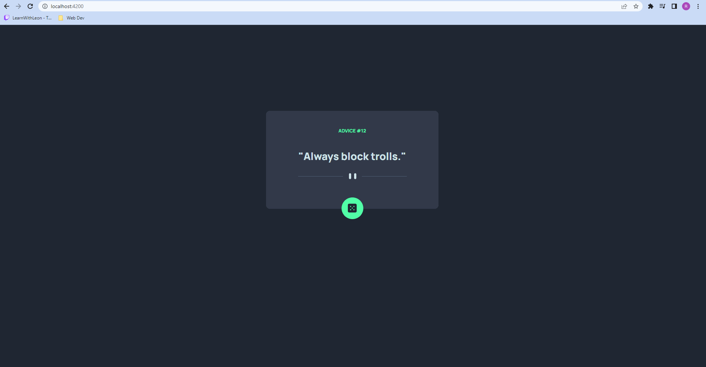

# Advice Generator
An Angular app version of a front end mentor challenege. The app uses the angular HTTPClient to make a request to an api and get a quote. 

**Link to project:** https://advice-generator-angular.netlify.app/

**Link to FrontEndMentor Challenge:** https://www.frontendmentor.io/challenges/advice-generator-app-QdUG-13db

## Development server

Run `ng serve` for a dev server. Navigate to `http://localhost:4200/`. The application will automatically reload if you change any of the source files.

## Build

Run `ng build` to build the project. The build artifacts will be stored in the `dist/` directory.

## How It's Made:

**Tech used:** Angular
